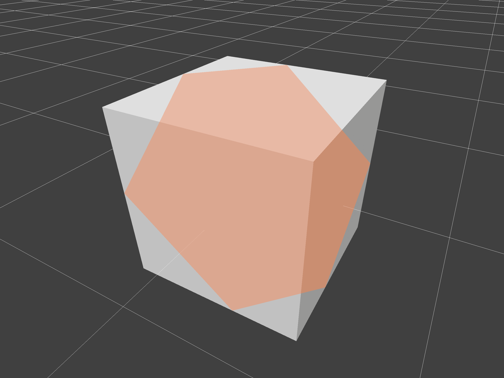
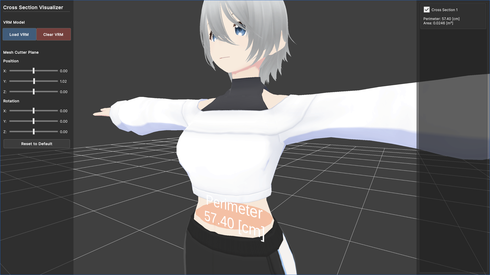

# GeometryToolkit

GeometryToolkit is a mesh processing library for Unity.



## Features
**MeshCutter**: Cuts meshes with a plane and get intersection points and lines.

**ContourLoopExtractor**: Extracts contour loops from a mesh cut result.

**CrossSection**: Generates cross-section meshes from contour loops.

## Usage
```csharp
using System.Collections.Generic;
using UnityEngine;
using GeometryToolkit;

public class Example : MonoBehaviour
{
    void Start()
    {
        // Create mesh
        var obj = GameObject.CreatePrimitive(PrimitiveType.Cube);
        var mesh = obj.GetComponent<MeshFilter>().mesh;

        // Create mesh data buffer
        var meshData = MeshDataBuffer.Create(mesh, obj.transform);

        // Cut the mesh with a horizontal plane at y=0
        var cuttingPlane = new Plane(Vector3.up, new Vector3(0, 0, 0));
        var meshCutData = MeshCutter.Execute(new List<MeshDataBuffer>(){ meshData }, cuttingPlane);

        // Extract contour loops
        var contours = ContourLoopExtractor.Execute(meshCutData);

        // Generate cross-section from the first contour
        var crossSection = CrossSection.Generate(contours[0]);

        Debug.Log($"Perimeter: {crossSection.Perimeter} [m], Area: {crossSection.SignedArea} [m²], Centroid: {crossSection.Centroid}");
    }
}
```

## Installation
You can install via Package Manager in UnityEditor.

1. Open the Package Manager window
2. Click the + button and select "Add package from git URL"
3. Enter: `https://github.com/sotanmochi/GeometryToolkit.git?path=src/GeometryToolkit.Unity/Assets/GeometryToolkit#1.0.0`

You can also install via editing Packages/manifest.json directly.
```
// Packages/manifest.json
{
  "dependencies": {
    ...
    "jp.sotanmochi.geometrytoolkit": "https://github.com/sotanmochi/GeometryToolkit.git?path=src/GeometryToolkit.Unity/Assets/GeometryToolkit#1.0.0",
    ...
  }
}
```

## Demo

[CrossSectionVisualizer](https://sotanmochi.github.io/GeometryToolkit/CrossSectionVisualizer/)


